# ELK Stack
최근 본사에서 정책모니터링 관련 서비스를 운영하면서 장애에 빠르게 대응하기 위해 프로세스 관제가 필요해졌습니다. ELK Stack으로 모니터링 시스템 환경을 구축하면서 얻은 경험을 공유하기 위해 이 문서를 작성하였습니다.

## ELK Stack ?

**ELK** 는 Elasticsearch, Logstash, Kibana 오픈 소스 프로젝트로 구성되어 있습니다.
 Elasticsearch 는 검색 및 분석 엔진입니다.
 Logstash는 여러 소스에서 동시에 데이터를 수집하여 변환한 후 Elasticsearch 로 전송하는 서버 사이드 데이터 처리 파이프라인입니다.
 Kibana는 사용자가 Elasticsearch에서 차트와 그래프를 이용해 데이터를 시각화할 수 있게 해줍니다.

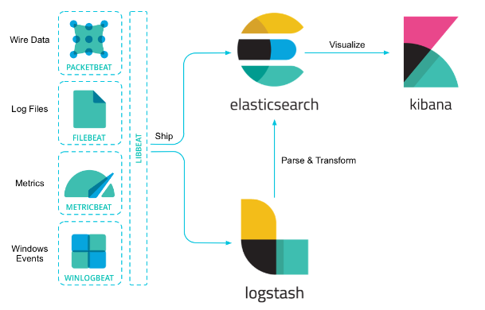

수집할 수 있는 로그의 형태는 파일부터 각종 시스템 정보(Elasticsearch에선 Metric이라 부릅니다) 등이 존재하는데 elastic에선 이와 같은 데이터를 수집할 수 있는 수집기를 무료로 제공하고 있습니다.

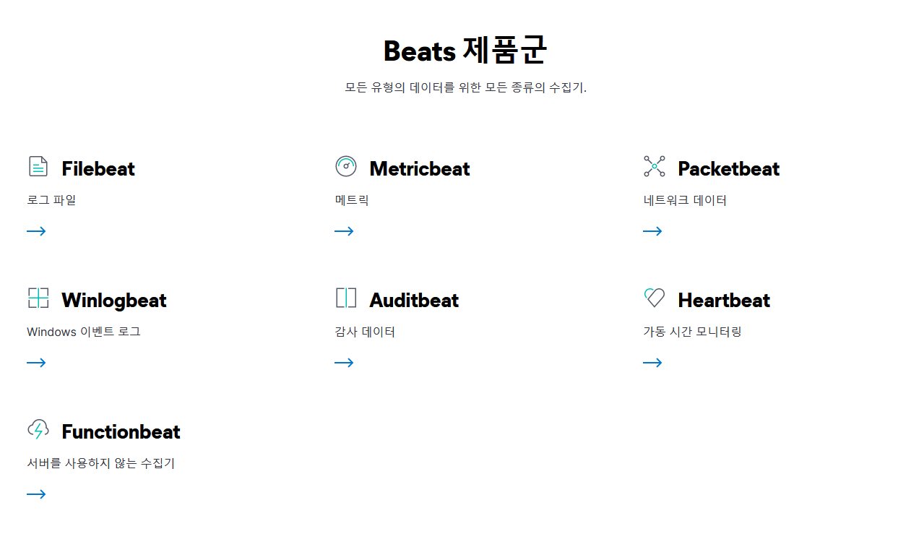

엘라스틱은 Elasticsearch + Logstash + Kibana + Beats 를 Elasic Stack 으로 통합하여 부르고 있습니다.

## Elasticsearch 설치

Elasticsearch는 기본적으로 **X-Pack** (Security, Alerting, Monitoring, Reporting, Machine Learning 등) 이 포함되어 있습니다. 예전에는 무료로 사용이 가능했지만 6.3버전 이후부터 라이센스가 변경되었기 때문에 알림과 같은 유용한 기능을 사용하려면 별도 라이센스 비용을 지불해야합니다. X-Pack 대신 AWS에서 공개한 Open Distro 를 사용하여 알림 기능을 사용하기로 했습니다.

(X-Pack 이 포함된 Basic 버전은 무료이긴 하지만 Elastic 제품을 내재한 제품으로 비즈니스를 하려면 Elasic사와 라이센스 계약이 필요합니다.)

yum, rpm, tarball 등의 다양한 방법으로 설치가 가능하지만 docker 를 사용하여 설치를 진행했습니다.

### docker-compose

docker를 사용하다보면 컨테이너 실행 옵션이 많아질 경우 도커 명령어의 옵션이 장황해지는 경우가 많습니다. 그리고 컨테이너의 실행 순서가 존재하는 경우 이를 기억하기 위해 별도의 문서로 관리를 해야하는데 docker compose라는 툴을 이용하여 이와 같은 부분을 해소할 수 있습니다.

### docker-compose.yml
~~~yaml
version: '3.8'
services:
  elasticsearch:
    image: docker.elastic.co/elasticsearch/elasticsearch-oss:7.10.2
    container_name: es01
    user: '1001' # 컨테이너 내부 계정이 아닌, 외부 계정이다. 단, docker group 계정이어야 함.
    environment:
      - cluster.name=es-docker-cluster
      - node.name=c1.erica.moara.org
      - node.master=true
      - node.data=true
      - discovery.seed_hosts=192.168.0.82,192.168.0.83
      - cluster.initial_master_nodes=192.168.0.82
      - bootstrap.memory_lock=true
      - network.publish_host=192.168.0.82
      - "ES_JAVA_OPTS=-Xms512m -Xmx512m"
    ulimits:
      memlock:
        soft: -1
        hard: -1
    ports:
      - 9200:9200
      - 9300:9300
    volumes:
      - /opt/elk/elasticsearch/data:/usr/share/elasticsearch/data
~~~
### Elasticsearch 실행

YAML 형식의 docker compose 설정 파일을 작성한 뒤 해당 경로에서 다음 명령어로 컨테이너 실행을 진행합니다. 아래 명령어로 docker image 빌드부터 설치 및 background 구동 과정 작업을 모두 진행합니다.
~~~
$ docker-compose up -d
~~~
## Logstash 설치

### Logstash docker compose
~~~yaml
version: '3.8'
services:
logstash:
image: docker.elastic.co/logstash/logstash-oss:7.10.2
ports:
- 5044:5044
volumes:
- ./logstash.conf:/usr/share/logstash/pipeline/logstash.conf
~~~
### 설정

logstash는 설정이 전부이며 설정은 크게 input / filter / output 구조로 되어 있습니다.
 input → filter → output 프로세스로 각각 다양한 플러그인을 통해 여러 종류의 데이터 처리가 가능합니다.

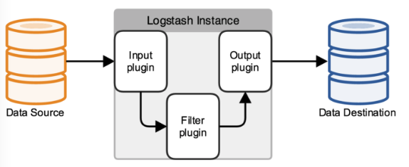

### Input

logstash를 통해 입력받을 소스에 대한 설정으로 다양한 input을 지원합니다.
- azure, beats, cloudwatch, couchdb, elasticsearch, file, github, rabbitmq, redis 등등
~~~groovy
input {
    beats {
        port => 5044
        host => "0.0.0.0"
        client_inactivity_timeout => 3600
    }
}
~~~
### Filter

수집한 로그를 어떻게 파싱할지에 대한 설정으로 messge 필드에 저장됩니다. 단순 로그 수집이나 알림 기능으로만 사용하는게 아닌 로그를 이용하여 데이터 분석을 하려면 filter 를 통해 데이터를 세분화하는 작업이 필요합니다.

logstash 에서 filter 중에 가장 빈번하게 사용되는게 grok (grok: 이해하다) 플러그인 입니다.
날짜, 경로 등의 미리 정의된 패턴은 바로 활용이 가능합니다.
~~~groovy
filter {
    if [fields][log_type] == "java" {
        grok {
            match => { "message" => "%{TIMESTAMP_ISO8601:timestamp} \[%{DATA:thread}\] %{LOGLEVEL:log-level} %{GREEDYDATA:message}" }
        }
        date {
            match => ["timestamp", "yyyy-MM-dd HH:mm:ss", "ISO8601"]
            target => "@timestamp"
        }
    }
}
~~~
### Output

output은 logstash로 처리한 데이터를 전달할 destination을 설정합니다.
다양한 output plugin 이 존재합니다.

- elasticsearch, csv, email, file, http, kafka, rabbitmq, redmine, redis, s3 등등
~~~groovy
output {
    elasticsearch {
        hosts => "10.10.1.16:9200"
        manage_template => false
        index => "%{[@metadata][beat]}-%{[fields][index_name]}-%{+YYYY.MM.dd}"
        document_type => "%{[@metadata][type]}"
    }
}
~~~
## Kibana 설치

### Kibana docker compose
~~~yaml
version: '3.8'
services:
    kib01:
        image: docker.elastic.co/kibana/kibana-oss:7.10.2
        environment:
            ELASTICSEARCH_URL: http://192.168.0.82:9200
            ELASTICSEARCH_HOSTS: '["http://192.168.0.82:9200"]'
        ports:
            - 5601:5601
volumes:
    data:
        driver: local
~~~
### Kibana 실행
~~~
$ docker-compose up -d
~~~
## Beats

마찬가지로 yum, rpm, docker 등 다양한 방법으로 설치가 가능합니다.
 beat 는 아래와 같은 다양한 모듈을 기본적으로 제공하고 있습니다.

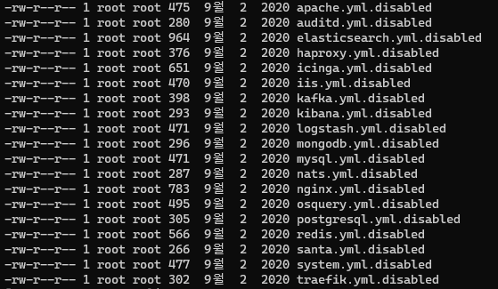

## Kibana

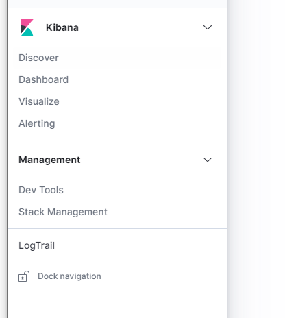

- Discover: 특정 index pattern에 대한 데이터를 조회
- Dashboard: 사용자가 배치한 시각화의 모음
- Visualize: 시각화 생성
- Alerting: Open Distro 플러그인 통해 추가된 알림 기능
- Dev Tools: REST 명령으로 데이터 조회
- Stack Management: index pattern 관리, 설정 관리

kibana를 사용하는 순서는 다음과 같습니다.

1. Stack Management에서 index pattern 생성
2. Visualize 에서 시각화 생성 (차트 생성)
3. Dashboard 에서 생성한 시각화 조합

### Index Pattern 생성

Index Patterns 를 클릭합니다.

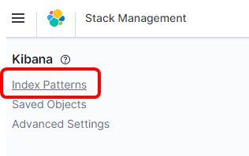

Create index pattern를 클릭합니다.

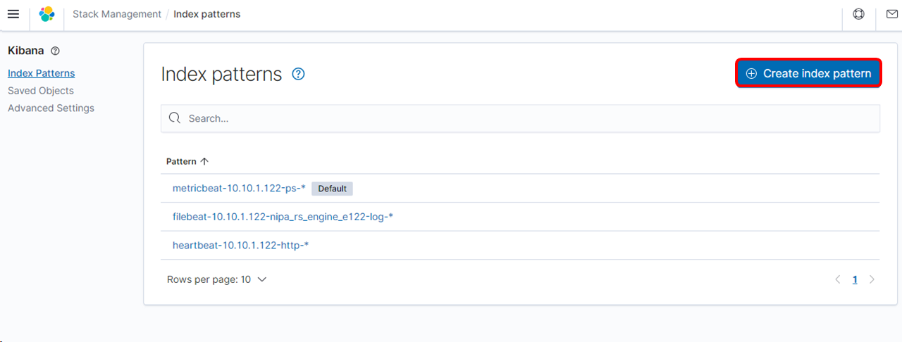

index pattern name을 입력한 후 Next step을 클릭합니다. (asterisk * 지원)

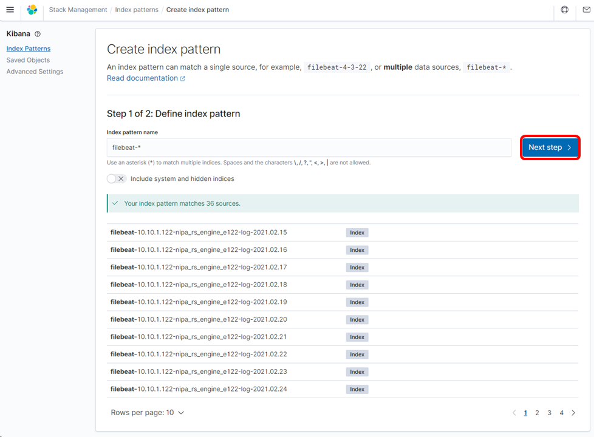

여기서 중요한 점은 Time field 설정입니다. 기본 날짜 필드를 자동적으로 부여되는 생성날짜로 사용할지 로그 내에 존재하는 사용자 날짜 필드를 사용할지 선택합니다.

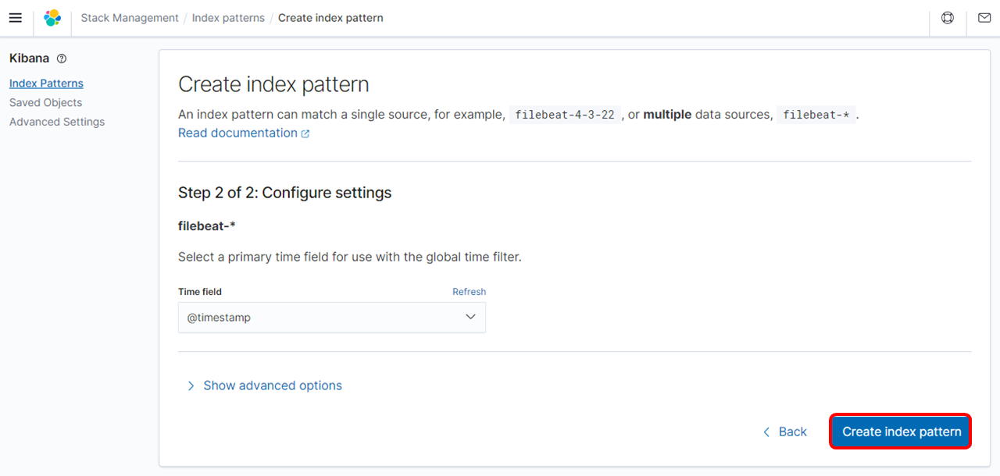

이후 Discover 메뉴에서 조회가 가능합니다.

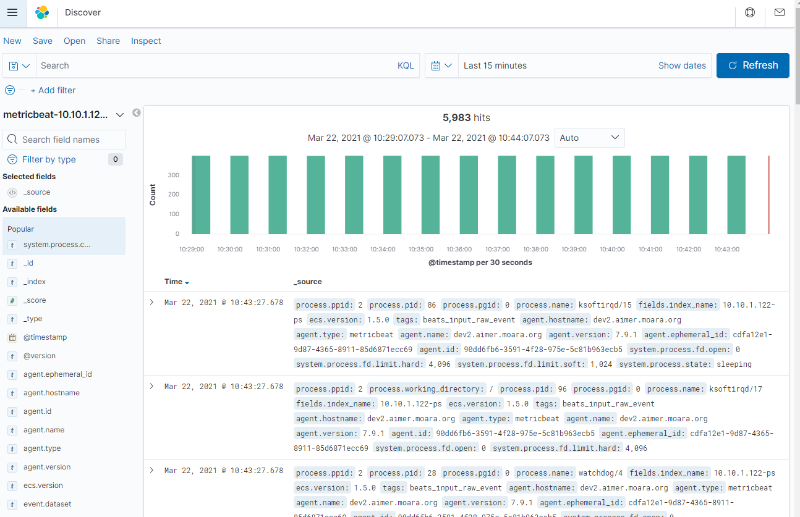

## Kibana - Alerting

### 정책 모니터링 관련 알람 설정

정책모니터링 시스템은 기능에 따라 서비스가 나눠져 있고 개수가 많으며 24시간 서비스되어야 하는 시스템입니다. 프로세스와 http 응답 로그를 수집하여 프로세스가 정상적으로 기동 중인지 모니터링하고 만약 서비스 DOWN되었다고 판단되면 슬랙 채널로 알림을 주도록 설정했습니다.

Kibana를 이용하여 알람을 설정하려면 Monitor, Trigger, Destination을 설정해야합니다.

### Destination

Add destination 버튼을 눌러 Destination 생성 화면으로 이동합니다.

Name, Type 을 선택하고 slack의 경우 Webhook URL을 입력합니다.
 (슬랙뿐만아니라 이메일, custom webhook 도 지원합니다.)

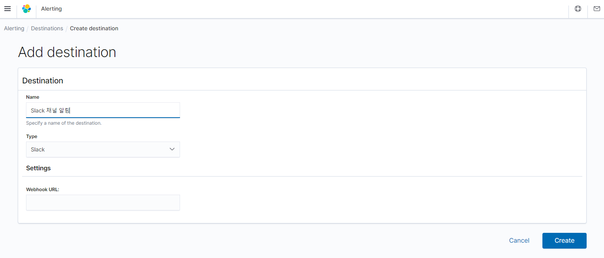

### Monitor

Create monitor 버튼을 눌러서 Monitor 생성 화면으로 이동합니다.

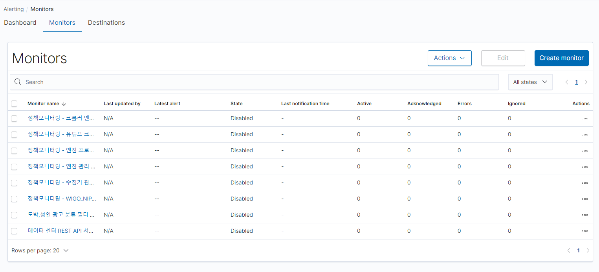

Monitor 이름을 입력하고 Define monitor 항목에서 Method of definition 항목을 선택합니다.
항목에는 2가지가 존재하는데 elastic query를 이용하는 방법과 visual graph을 이용하는 방법이 있습니다.

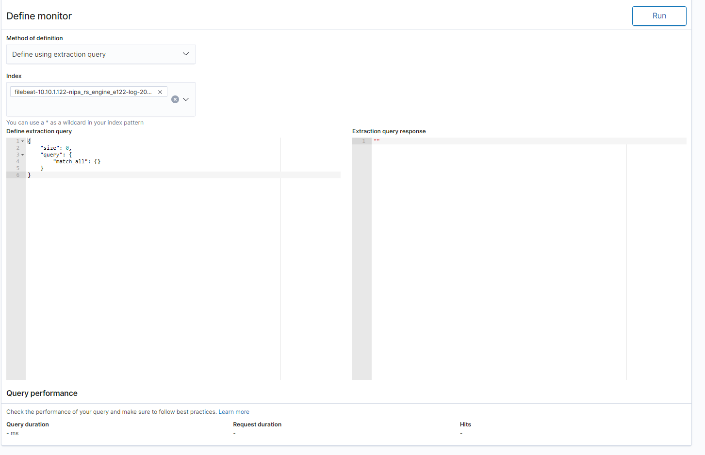

아래는 최근 5분 동안 system.process.cmdline항목이 \*WIGO_CRAWLER_SERVER\*인 항목이 존재하는지 체크하는 쿼리 예시입니다. 데이터는 조회할 필요가 없기 때문에 size항목은 0을 설정합니다.
~~~json
{
   "size":0,
   "query":{
      "bool":{
         "must":[
            {
               "range":{
                  "@timestamp":{
                     "from":"now-5m/m",
                     "to":null,
                     "include_lower":true,
                     "include_upper":true,
                     "boost":1
                  }
               }
            },
            {
               "wildcard":{
                  "system.process.cmdline":{
                     "wildcard":"*WIGO_CRAWLER_SERVER*",
                     "boost":1
                  }
               }
            }
         ],
         "adjust_pure_negative":true,
         "boost":1
      }
   }
}
~~~
모니터링 스케쥴을 설정합니다.
 By interval, Daily, Weekly, Monthly, Custom Cron Expression 등 설정이 가능합니다.

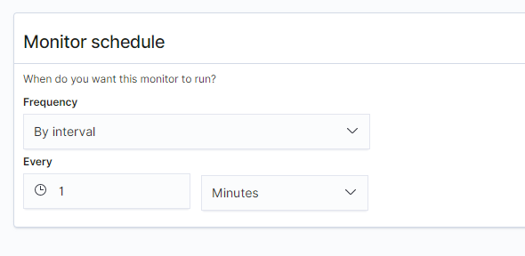

### Trigger

Trigger name을 입력하고 Trigger condition을 설정합니다. monitor 결과에 대한 조건을 설정합니다.
만약 조회되는 결과가 없을 경우에 대한 트리거를 설정하려면 아래와 같이 입력합니다.
~~~
ctx.results[0].hits.total.value == 0
~~~
마지막으로 Configure actions 를 설정합니다.
 Action name을 입력하고 아까 생성한 destination을 선택합니다.

Send test message를 눌러 slack 메시지가 오는지 확인 후 trigger를 생성합니다.

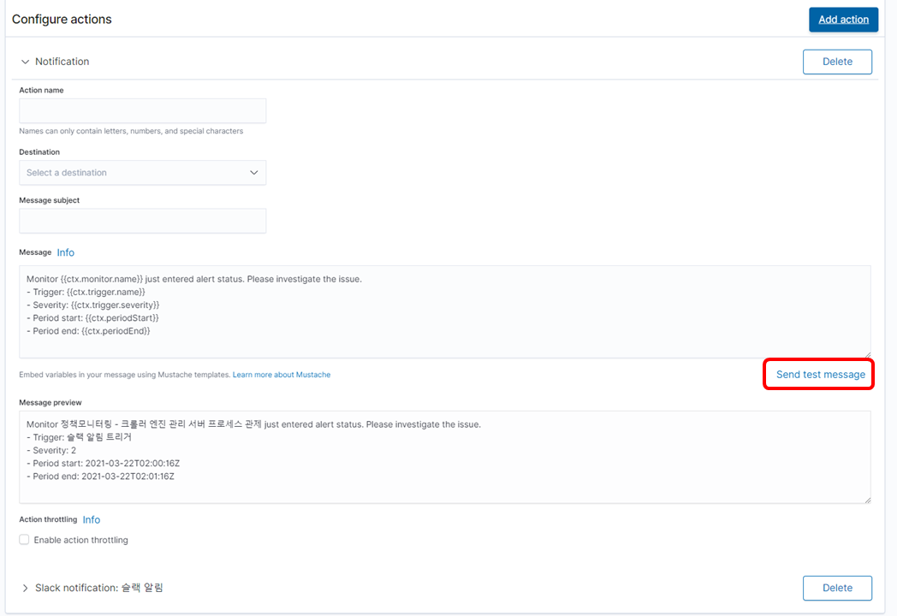

## Kibana - dashboard 활용

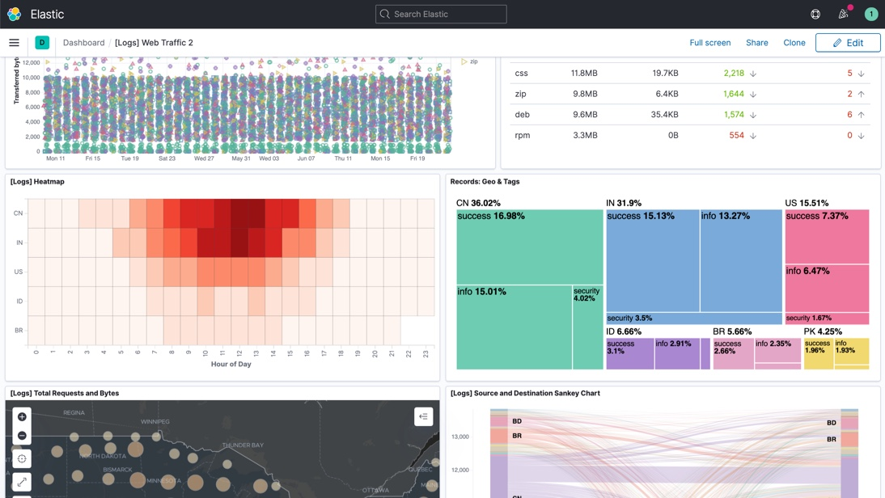 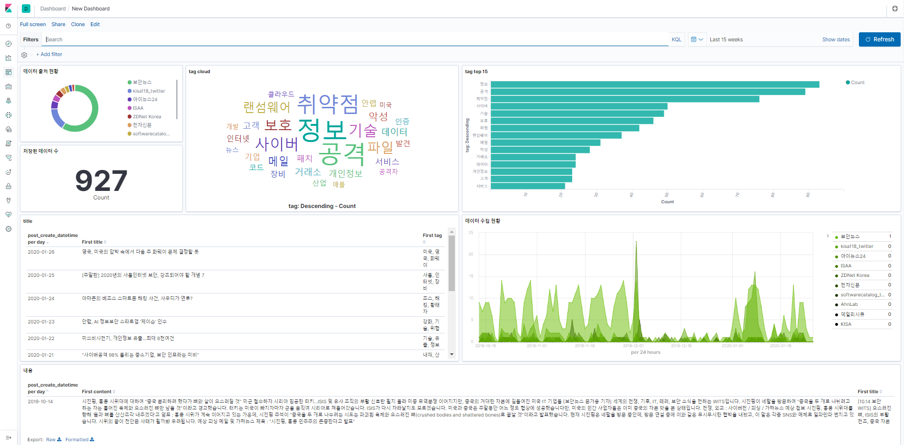

## 부가적인 활용

### logstash logback

application 단에서 json 등으로 정의된 로그를 logstash에 전송 가능
~~~xml
<?xml version="1.0" encoding="UTF-8"?>
<configuration>
    <appender name="LOGSTASH" class="net.logstash.logback.appender.LogstashTcpSocketAppender">
        <destination>127.0.0.1:4560</destination>
        <encoder class="net.logstash.logback.encoder.LogstashEncoder"></encoder>
    </appender>

    <root>
        <level value="INFO"/>
        <appender-ref ref="LOGSTASH"/>
    </root>
</configuration>
~~~
## ELK 권장 하드웨어 사양

### 기본 하드웨어 사양
* RAM: 64GB (32GB or 16GB 가능)
* CPU: 2 ~ 8 core
* SSD: 200GB
* RAID 0 (구성 디스크 속도 향상)

### 메모리 : 하드디스크 구성 비율
* 검색엔진 비율 <1:16>
* 로깅 시스템 <1:48, 1:96 등>

### Logstash
* RAM: 8 ~ 32GB
* CPU: 4 ~ 16 core

### Elasticsearch (Master)
* RAM: 8GB
* CPU: 4core

### Elasticsearch (Data)
* RAM: 16GB ~ 32GB
* CPU: 8 ~ 16 core

### Kibana
* CPU: 2 core
* RAM: 4GB ~ 8GB